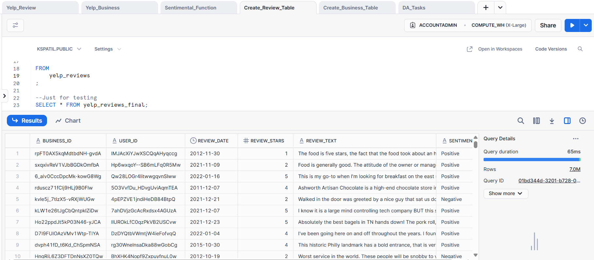
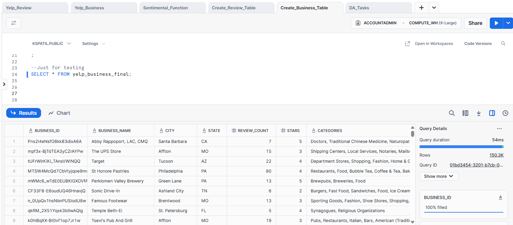
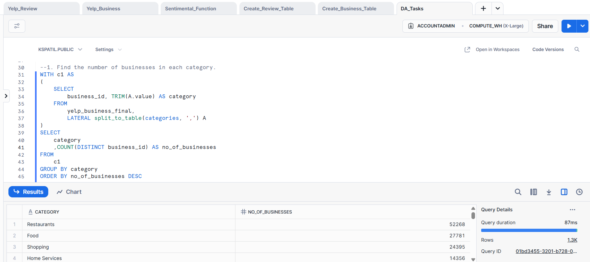

# 📊 Yelp Dataset Analysis Using Snowflake & Python

This project demonstrates how to process and analyse the Yelp Open Dataset using Python, AWS S3, and Snowflake SQL. It includes structured table creation from JSON, sentiment analysis via Python UDFs, business and review analytics, and SQL-based data tasks.

---

## ✅ Steps to Perform This Project

1. **Download the dataset** from the [Yelp Open Dataset](https://business.yelp.com/data/resources/open-dataset/).
2. Use **`Split_Files.ipynb`** (a Jupyter notebook written in Python) to split large JSON files into smaller parts.
3. **Upload** the split files to your AWS **S3 bucket**.
4. Create an **IAM User** and generate the **Access Key ID** and **Secret Access Key**.
5. Execute the SQL scripts provided in the **`Snowflake Queries/`** folder to set up your database in Snowflake.
6. Perform data analysis using queries from the task file.

---

## 🗂️ Project Structure

<pre>
yelp_dataset_analysis/
├── Split_Files.ipynb                  # Python notebook to split large JSON files
├── Snowflake Queries/                # All SQL and task files for Snowflake
│   ├── 1. Yelp_Review.sql
│   ├── 2. Yelp_business.sql
│   ├── 3. Sentimental_function.sql
│   ├── 4. Create_Review_Table.sql
│   ├── 5. Create_Business_Table.sql
│   ├── 6. DA_Tasks.txt
│   └── 7. DA_Tasks_with_solutions.sql
├── screenshots/
│   ├── review_table_screenshot.png
│   ├── business_table_screenshot.png
│   └── task_1_solution_screenshot.png
├── requirements.txt
├── README.md
</pre>

---

## 📂 Snowflake Queries

| File Name                        | Description |
|----------------------------------|-------------|
| `1. Yelp_Review.sql`             | Loads raw review JSON data from S3 into a Snowflake VARIANT table using `COPY INTO`. |
| `2. Yelp_business.sql`           | Loads raw business JSON data from S3 into a Snowflake VARIANT table using `COPY INTO`. |
| `3. Sentimental_function.sql`    | Creates a Python UDF (`analyze_sentiment`) using `textblob` to classify reviews into Positive, Neutral, or Negative. Includes test reviews for validation. |
| `4. Create_Review_Table.sql`     | Creates `yelp_reviews_final` by extracting structured fields and applying sentiment labels. |
| `5. Create_Business_Table.sql`   | Creates `yelp_business_final` from the raw business data, extracting name, city, star ratings, and categories. |
| `6. DA_Tasks.txt`                | A list of 10 data analysis tasks (e.g. top users, five-star businesses, sentiment breakdown) to be solved using SQL. |
| `7. DA_Tasks_with_solutions.sql` | Contains SQL solutions to the tasks above, using advanced Snowflake SQL features like `COUNT_IF`, `LISTAGG`, `ROW_NUMBER`, and `QUALIFY`. |

---

## 🧠 Key Features

- ✅ Sentiment analysis using Python UDFs in Snowflake
- 📊 Business and review insights based on stars and categories
- 🧑‍💻 Top user and business analytics using SQL
- 🧩 Real-world SQL tasks for hands-on data analysis practice
- 🔗 Seamless integration between Python, AWS S3, and Snowflake

---

## 🖼️ Sample Outputs

### 📋 `yelp_reviews_final` Table

### 🏢 `yelp_business_final` Table

### 🧪 Task 1: Finding number of businesses in each category

---

## 📺 Tutorial Reference

**By Ankit Bansal**

- 🎥 [YouTube Playlist (Video 5)](https://www.youtube.com/watch?v=oXLxbk5USFg&list=PLBTZqjSKn0Ie0FvR3_ass_iTIqYV_CAth&index=5)  
- 💻 [GitHub Repo](https://github.com/ankitbansal6/end_to_end_data_analytics_project/tree/main)

---

## 🔗 Dataset Source

- **Yelp Open Dataset**  
  🔗 [https://business.yelp.com/data/resources/open-dataset/](https://business.yelp.com/data/resources/open-dataset/)

---

## 👤 Author

**Kushal Patil**  
Feel free to fork this repository, raise issues, or suggest improvements.

---

## 📃 License

This project is intended for educational and experimental purposes only. Attribution is maintained to the original dataset provider (Yelp) and the referenced tutorial author (Ankit Bansal).

---

